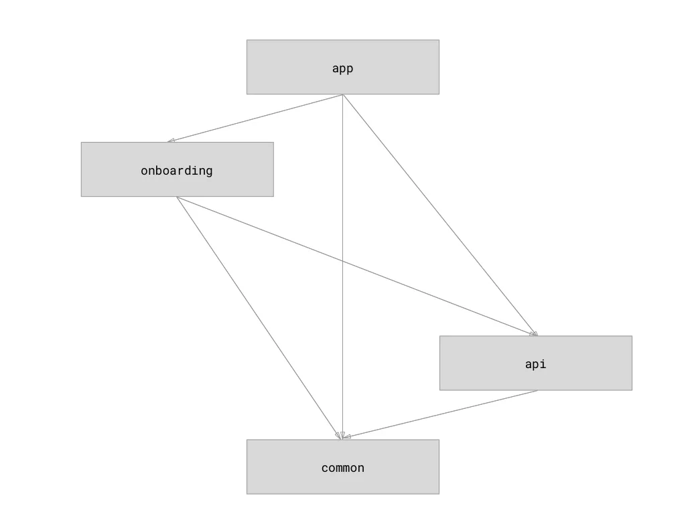
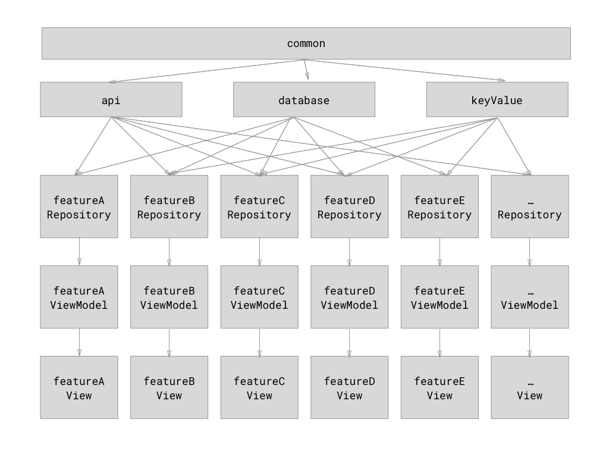

# Structure & Architecture

(This char needs to be update to add `database` as the 5th module)

## Modules

The app currently has 5 modules
- `app`: the main one
- `api`: talk to the loft api
- `common`: common components across 2+ modules
- `database`: talk to local database
- `onboarding`: feature module that contains the onboarding flow

Instead of having only pure feature modules + 1 common module, I decided
to create component modules (`api` & `database` specifically) for
several reasons

- for both
    - ensure the dto and entities are self-contain, and the features
    modules won't even be able to access them directly
    - 1 single place to control them if migration is needed
        - db schema update
        - api version upgrade/behaviour change
- for `database`
    - 1 database + 1 connection only

This is not the best thing to do if this needs to scale to very large,
but that will be in distance future, plus it shouldn't be that hard to
split them back up by features.

## Internal dependencies

Now you know what modules do we have and what do they do, let's see how
they use each other

This graph has been slightly simplified, including
- feature modules also depends on `common` modules directly
- `app` and `onboarding` are just 2 big group of features, and in this
graph they have been broken back down to small features
- `keyValue` currently lives inside common

So the dependency graph should be pretty straight forward:
- everyone depends on `common`
- features repository pick what data component they need to depend on
    - `api`
    - `database`
    - `keyValue`
- each feature has a view (obviously)
- ViewModel ties view and repository together
    - That might change soon: Issue #17 will investigate how to break
    use case out from ViewModel